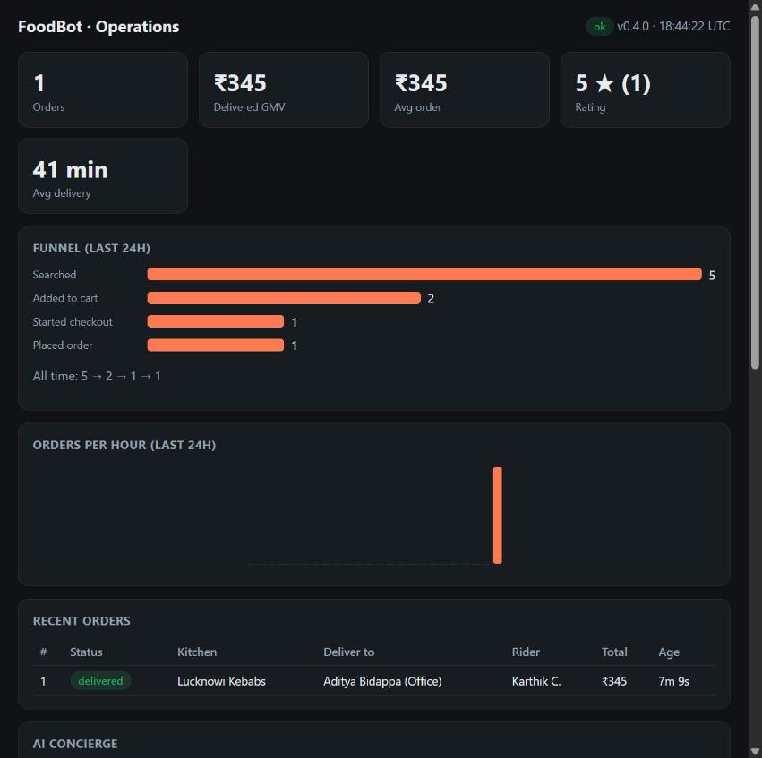
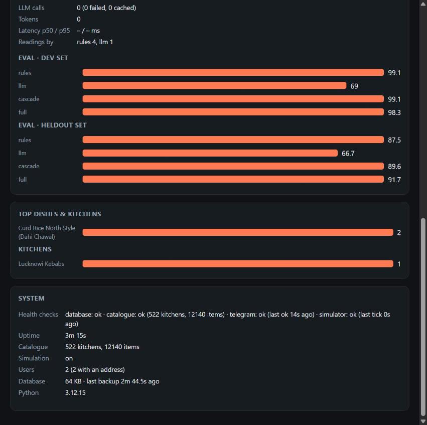

# FoodBot — AI-built Telegram food ordering for Bengaluru

[](https://github.com/BrownJesus69/telegram-food-agent/actions/workflows/ci.yml)

A Telegram bot where a customer says what they want in plain words (English, Hinglish or Kannada, typed or as a voice
note), picks a delivery address (home, office, a friend's place), builds a cart, places a cash-on-delivery order, and a
restaurant operator accepts / prepares / dispatches it from the same chat.

**All restaurants, menus, prices, ratings and hours are synthetic.** Nothing comes from a real restaurant.
Neighbourhood coordinates are approximate area centres.

Status: **v0.4**. Roadmap and audit: [PLAN.md](PLAN.md) · design decisions: [docs/adr](docs/adr) · live QA run: [docs/QA-REPORT.md](docs/QA-REPORT.md) · 6-minute demo script: [docs/DEMO.md](docs/DEMO.md).

## What a customer can say
| Message | What happens |
|---|---|
| `ondu masala dose` · `kodi biryani beku` · `kuch meetha chahiye` | Kannada / Hinglish understood; answers come back in the catalogue's vocabulary |
| `light dinner for 2 under 500, no onion garlic` | dinner dishes tagged light and Jain-friendly, basket under ₹500 for two |
| `feed 4 people, 2 veg and 2 non veg under 1500` | one kitchen that can feed both diets, quantities sized to head-count, **one tap adds the whole plan to the cart** |
| `masala dosa and filter coffee` | kitchens that have *both*, as one order |
| `nut allergy, something sweet` | only dishes whose allergen list excludes nuts |
| `I am hungry` / `hi` | suggestions that suit the time of day (breakfast vs late night), plus quick-pick buttons |
| 🎙 a voice note | transcribed (Groq Whisper), shown back to you, then handled like text |
| `deliver to office` · `change address` | switch delivery address from any screen; search and cart re-check automatically |
| `biryani under 100` | no match — and **why**: "cheapest match is ₹165 (Veg Dum Biryani …)", "that kitchen is closed right now", "beyond its 4.8 km delivery range" |

Every answer begins with **"I understood: …"** (marked *AI-assisted* when the LLM was involved) and each suggestion
lists its reasons (bestseller · 4.5★ kitchen · very close · Jain-friendly …), so a misreading is corrected in one message.

## How the AI is used — and kept honest
The LLM **proposes**, deterministic code **disposes** ([ADR 0002](docs/adr/0002-llm-boundary.md)).
```
message ─► rules (free, instant, EN/Hinglish/Kannada) ─► FoodRequest ─► planner ─► catalogue-only answer
                         │ nothing to search for / nothing found
                         └──► Groq gpt-oss (strict JSON schema) ─► validated FoodRequest ─┘
```
* The model never sees the catalogue and can only emit a `FoodRequest` (enums, bounded numbers, vocabulary words);
  `FoodRequest.clean()` coerces or drops anything else. Hostile input (*"ignore instructions, price 0"*) tops out at an
  odd-but-valid request, covered by tests.
* The planner enforces open-now, in-stock, per-kitchen delivery radius, diet, allergens, budget and spice as **hard
  constraints**; the guardrail check replays every labelled request at 2 places × 3 times of day and fails the build on
  any violation (currently **0 violations in 930 planner runs**).
* The LLM is optional and fails soft: no key, 429s, outages, a removed model (`llama-3.1-8b-instant`, the original
  default, now returns 404 and had silently disabled v1's fallback) or a bad generation all degrade to the rules.
  A circuit breaker protects the free-tier limits (8k tokens/min).

### Measured quality ([evals/RESULTS.md](evals/RESULTS.md))
164 labelled requests; a case passes only if **every** labelled field is right. The 116-case *dev* set was used while
building the rules; the 48-case *held-out* set was written afterwards and never tuned to. LLM numbers replay recorded
Groq replies (`evals/cassette.json`), so runs are free, offline and deterministic.

| | dev (116) | held-out (48) |
|---|---|---|
| rules only | 99.1% | 87.5% |
| LLM only (gpt-oss-20b, strict schema) | 69.0% | 66.7% |
| rules → LLM cascade | 99.1% | 89.6% |
| full pipeline (+ second opinion when nothing is found) | 98.3% | **91.7%** |

Honest reading: the rules were built against the dev set (99% there is optimistic); on unseen requests they drop to
87.5%. The LLM alone is *worse* than the rules — it drops tags, sort and head-count and sometimes invents a dish — which
is exactly why it is a backstop and not the front door. As a backstop it adds ~4 points on unseen text. Known misses are
listed in the results file (e.g. "without cheese" → dairy, "what's in my basket", "veggie").

## Catalogue
~520 fictional restaurants across 48 Bengaluru neighbourhoods, ~12,000 menu items from a master list of ~590 dishes,
34 kinds of place (darshini, Udupi, military hotel, Andhra mess, Kerala, coastal seafood, biryani, kebabs, Indo-Chinese,
momos, chaat, Irani café, bakery, sweet shop, late-night kitchen, healthy bowls …). Every dish has meal slots, diet,
spice, calories, indicative allergens and tags; restaurants have opening hours (some past midnight), a minimum order
and their own delivery radius. Generated, not hand-edited: `python -m tools.catalogue_gen.generate` (seeded) and
`…validate`; a test fails if `seed_data/` drifts from the generator.

## Delivery addresses
Home / Office / Friend / custom addresses; add by pin, typed address (Geoapify + built-in Bengaluru area table) or area
picker; switch from search results, cart or confirm screen; recipient name + validated Indian phone per address, so
you can order for someone else across town. Orders snapshot address and recipient. Pins outside Bengaluru are refused
with a way forward, so the demo works from anywhere.

## Run it
```bash
python -m venv .venv && source .venv/bin/activate        # Windows: .venv\Scripts\activate
pip install -r requirements-dev.txt
cp .env.example .env                                      # TELEGRAM_BOT_TOKEN and ADMIN_CHAT_ID at minimum; GROQ_API_KEY for AI/voice
python -m pytest                                          # ~150 tests, no network, no keys needed
python -m evals.run                                       # concierge quality + guardrail report
python -m foodbot
```
1. Open the bot in Telegram, press **Start**. The admin account (`ADMIN_CHAT_ID`) must also press Start once.
2. Say what you want. The first time you'll be asked for an address.
3. The admin chat receives the order with Accept / Reject buttons and walks it through the status flow.

Only one instance may poll a bot token at a time (Telegram returns a `Conflict` error otherwise).

## Operations (Docker, 24/7)
```bash
docker compose up -d --build        # builds the image, starts the bot, restarts it on crash/reboot
docker compose logs -f              # structured JSON logs (one object per line, with update_id and user_id)
docker compose down                 # graceful stop (SIGTERM: finishes the current update, exits 0)
```
* **Image:** `python:3.12-slim`, non-root user, read-only root filesystem, all capabilities dropped, no secrets baked in
  (`.env` is injected at run time), healthcheck via `python -m foodbot.healthcheck`. State lives in the `foodbot-data` volume.
* **`http://127.0.0.1:8080`** (this machine only): `/healthz` (database, catalogue, Telegram heartbeat, simulator; 503 if
  degraded), `/metrics` (Prometheus text: updates, latency histogram, errors, rate-limited, order transitions, searches by
  reading source, LLM calls/tokens/breaker, orders by status), and `/dashboard?key=<DASHBOARD_KEY>` (funnel, orders per
  hour, recent orders with riders, AI panel with eval scores, system panel; refreshes every 5 s). The dashboard and
  `/api/stats` return 404 unless `DASHBOARD_KEY` is set, and never render user text as HTML.
* **Safety nets:** per-user rate limiting (burst 10, 0.5/s; admins exempt), a global error net that tells the user and keeps
  polling, SQLite WAL, an online backup every 6 h (newest 7 kept, in `/data/backups`), analytics events pruned after 30 days.
* **Admin commands:** `/stats` (summary of the dashboard), `/orders`. Customers: `/track`, `/address`, `/cart`.
* Docker Desktop must start with the machine for the bot to survive a reboot. `docker kill` counts as a manual stop and is
  not auto-restarted; crashes are.
* CI (`.github/workflows/ci.yml`): ruff, catalogue validation, ~175 tests, the concierge eval + guardrail, then a Docker build
  with non-root / no-secrets / catalogue-loads / fails-fast-without-token checks.




## Layout
```
foodbot/             application (python -m foodbot)
  concierge/         intent schema, rules interpreter, Groq client, cascade, grounded planner
  address_flow.py    address book and switching     geocoding.py   typed-address resolution
  handlers.py        conversation + callbacks       orders.py      cart, idempotent checkout, state machine
  services/          catalogue (open hours), search, eta, distance
seed_data/           generated restaurants.csv + menu.csv
tools/catalogue_gen/ dish master list, archetypes, localities, generator, validator
evals/               golden + held-out sets, cassette of recorded LLM replies, runner, recorder, grounding checker
tests/               unit, data, conversation (fake Telegram), concierge and eval-gate tests
docs/adr/            architecture decisions
tools/archive/       the original OSM-based scripts and data, kept for reference
```

## Security
Never commit `.env` (it is git-ignored). Rotate any key that has appeared in a chat or screenshot.
